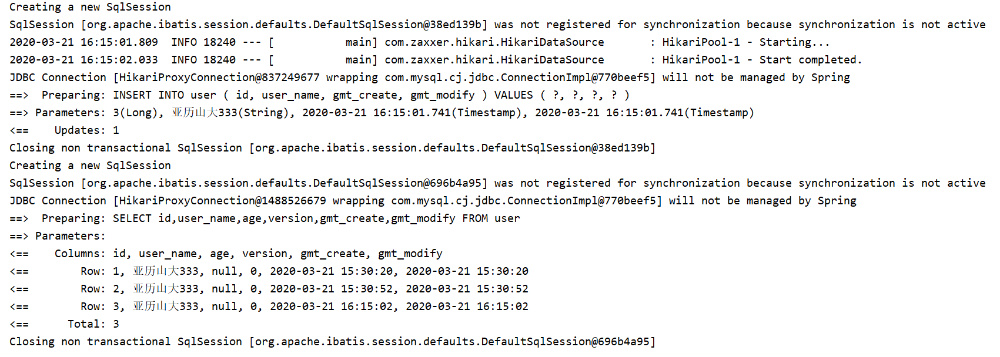
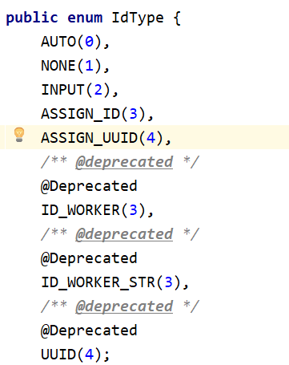
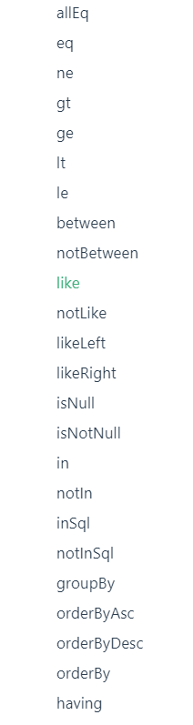

## Mybatis-Plus-demo

### 快速开始：
- 导入依赖(尽量不要同时导入Mybatis和Mybatis-Plus，可能会有版本差异)
```xml
<dependency>
    <groupId>com.baomidou</groupId>
    <artifactId>mybatis-plus-boot-starter</artifactId>
    <version>3.3.1.tmp</version>
</dependency>
```
- 配置数据库
```properties
# mysql5驱动为com.mysql.jdbc.Driver(高版本兼容低版本)
spring.datasource.driver-class-name=com.mysql.cj.jdbc.Driver
spring.datasource.url=jdbc:mysql://localhost:3306/test?useUnicode=true&serverTimezone=GMT%2B8&characterEncoding=UTF8
spring.datasource.username=root
spring.datasource.password=root
```
- 继承BaseMapper<T>接口
```java
@Repository
public interface UserMapper extends BaseMapper<User> {
}
```
- 在主启动类上开启Mapper扫描
```java
@MapperScan("com.yjz.mp.demo.mapper")
public class DemoApplication {
    // 省略......
}
```

### 配置日志
配置日志之后，我们可以看到sql是如何执行的：
```properties
mybatis-plus.configuration.log-impl=org.apache.ibatis.logging.stdout.StdOutImpl
```


### CURD
CRUD就不再展示，总之`extends`BaseMapper之后，能够实现很多基本的增删改查操作。

说几个细节部分：

#### 主键生成策略



- AUTO(0)
    - 数据库ID自增
- NONE(1)
    - 未设置主键
- INPUT(2)
    - 手动输入
- ASSIGN_ID(3)
    - 默认的全局唯一ID
- ASSIGN_UUID(4)
    - ID
    
    
#### 自动填充
阿里巴巴开发手册：所有的数据库表：gmt_create、gmt_modified几乎所有的表都要配置上！而且需
要自动化！
##### 方式一：数据库级别（工作中不允许你修改数据库）
使用触发器的形式

##### 方式二：代码级别

- 首先将实体类字段上增加注解
```java
@TableField(fill = FieldFill.INSERT)
private Date gmtCreate;
@TableField(fill = FieldFill.INSERT_UPDATE)
private Date gmtModify;
```
- 编写处理器
```java
@Slf4j
@Component // 切记要把该Handler加入到IOC中
public class MyMetaObjectHandler implements MetaObjectHandler {
    // 插入时的填充策略
    @Override
    public void insertFill(MetaObject metaObject) {
        log.info("插入时填充");
        this.setFieldValByName("gmtCreate", new Date(), metaObject);
        this.setFieldValByName("gmtModify", new Date(), metaObject);
    }
    // 更新时的填充策略
    @Override
    public void updateFill(MetaObject metaObject) {
        log.info("更新时填充");
        this.setFieldValByName("gmtModify", new Date(), metaObject);
    }
}
```

###乐观锁
乐观锁实现方式：
- 取出记录时，获取当前 version
- 更新时，带上这个version
- 执行更新时， set version = newVersion where version = oldVersion
- 如果version不对，就更新失败

在Mybatis-Plus中使用方式：
- 数据库添加`version`字段
- 实体类添加相应的字段
```java
@Version
private Integer version;
```
- 注册组件
```java
@EnableTransactionManagement
@Configuration
public class MybatisPlusConfig {
    @Bean
    public OptimisticLockerInterceptor optimisticLockerInterceptor() {
        return new OptimisticLockerInterceptor();
    }
}
```

- Test测试
```java
// 模拟乐观锁
@Test
void testOptimisticLock(){
    // 线程1修改1号用户
    User user = userMapper.selectById(1L);
    user.setUserName("User1");
    user.setAge(17);
    // 线程2插队修改·1号用户
    User user2 = userMapper.selectById(1L);
    user2.setUserName("User2");
    user2.setAge(3);
    userMapper.updateById(user2);

    // 线程1只能yong自旋锁来多次尝试提交
    userMapper.updateById(user);
}
```

### 分页查询

使用广泛，类似有三种常用的：
- 原始的limit进行分页
- pageHelper第三方组件
- MP其实也内置了分页插件

使用步骤：
- 配置拦截器
```java
@Bean
public PaginationInterceptor paginationInterceptor() {
    return new PaginationInterceptor();
}
```
- 使用page对象进行查询
```java
// 测试分页
@Test
void testPage(){
    Page<User> page = new Page<>(2, 5);
    userMapper.selectPage(page, null);
    page.getRecords().forEach(System.out::println);
    System.out.println(page.getTotal());
}
```

### 删除操作

- 根据ID删除deleteById(id)
- 通过ID批量删除deleteBatchIds(list)
- 通过Map删除deleteByMap(map)

#### 逻辑删除
> 物理删除 ：从数据库中直接移除
  逻辑删除 ：再数据库中没有被移除，而是通过一个变量来让他失效！ deleted = 0 => deleted = 1
  
在MP中该功能不同版本变化较大，详细[参考文档](https://mp.baomidou.com/guide/logic-delete.html)


使用方法：
- 在数据库中添加一个deleted字段(int(1)即可)
- 在实体类中添加该属性
```java
@TableLogic
private Integer deleted;
```
- 配置逻辑删除组件(3.1.1开始不再需要这一步)
```java
// 逻辑删除组件！
@Bean
public ISqlInjector sqlInjector() {
return new LogicSqlInjector();
}

```
- 配置properties
```xml
mybatis-plus.global-config.db-config.logic-delete-value=1
mybatis-plus.global-config.db-config.logic-not-delete-value=0
```
- 测试DEMO
```java
// 测试LogicDeleted
@Test
void testLogicDeleted(){
    userMapper.deleteById(1L);
}
```
- 删除过程
```html
JDBC Connection [HikariProxyConnection@1410431463 wrapping com.mysql.cj.jdbc.ConnectionImpl@24386839] will not be managed by Spring
==>  Preparing: UPDATE user SET deleted=1 WHERE id=? AND deleted=0 
==> Parameters: 1(Long)
<==    Updates: 1
Closing non transactional SqlSession [org.apache.ibatis.session.defaults.DefaultSqlSession@524270b8]
```

### 性能插件

作用：性能分析拦截器，用于输出每条 SQL 语句及其执行时间

MP3.1.0 以上版本，推荐使用第三方组件`p6spy`。

[参考链接](https://mp.baomidou.com/guide/p6spy.html)


### 条件构造器Wrapper

若需要写一些复杂的sql就可以使用它来替代！



**demo测试：**
```java
@Test
void testWapper(){
    QueryWrapper<User> wrapper = new QueryWrapper<>();
    wrapper.eq("user_name", "User2");
    userMapper.selectList(wrapper).forEach(System.out::println);
}
```


### 代码生成器

这是我觉得Mybatis-Plus比较棒的功能

AutoGenerator 是 MyBatis-Plus 的代码生成器，通过 AutoGenerator 可以快速生成 Entity、
Mapper、Mapper XML、Service、Controller 等各个模块的代码，极大的提升了开发效率。

```java
public class CodeGenrator {

    public static void main(String[] args) {
        // 需要构建一个 代码自动生成器 对象
        AutoGenerator mpg = new AutoGenerator();
        // 配置策略
        // 1、全局配置
        // 注意GlobalConfig是com.baomidou.mybatisplus.generator.config.GlobalConfig;
        GlobalConfig gc = new GlobalConfig();
        String projectPath = System.getProperty("user.dir");
        gc.setOutputDir(projectPath+"/src/main/java");
        gc.setAuthor("Honyelchak");
        gc.setOpen(false);
        gc.setFileOverride(false); // 是否覆盖
        gc.setServiceName("%sService"); // 去Service的I前缀
        gc.setIdType(IdType.ID_WORKER);
        gc.setDateType(DateType.ONLY_DATE);
        gc.setSwagger2(false);
        mpg.setGlobalConfig(gc);
        //2、设置数据源
        DataSourceConfig dsc = new DataSourceConfig();
        dsc.setUrl("jdbc:mysql://localhost:3306/test?useSSL=false&useUnicode=true&characterEncoding=utf-8&serverTimezone=GMT%2B8");
        dsc.setDriverName("com.mysql.cj.jdbc.Driver");
        dsc.setUsername("root");
        dsc.setPassword("root");
        dsc.setDbType(DbType.MYSQL);
        mpg.setDataSource(dsc);
        //3、包的配置
        PackageConfig pc = new PackageConfig();
        pc.setModuleName("person");
        pc.setParent("com.yjz.mp.demo");
        pc.setEntity("entity");
        pc.setMapper("mapper");
        pc.setService("service");
        pc.setController("controller");
        mpg.setPackageInfo(pc);
        //4、策略配置
        StrategyConfig strategy = new StrategyConfig();
        strategy.setInclude("person"); // 设置要映射的表名
        strategy.setNaming(NamingStrategy.underline_to_camel);
        strategy.setColumnNaming(NamingStrategy.underline_to_camel);
        strategy.setEntityLombokModel(true); // 自动lombok；
        strategy.setLogicDeleteFieldName("deleted");
        // 自动填充配置
        TableFill gmtCreate = new TableFill("gmt_create", FieldFill.INSERT);
        TableFill gmtModified = new TableFill("gmt_modified", FieldFill.INSERT_UPDATE);
        ArrayList<TableFill> tableFills = new ArrayList<>();
        tableFills.add(gmtCreate);
        tableFills.add(gmtModified);
        strategy.setTableFillList(tableFills);
        // 乐观锁
        strategy.setVersionFieldName("version");
        strategy.setRestControllerStyle(true);
        strategy.setControllerMappingHyphenStyle(true);
        //localhost:8080/hello_id_2
        mpg.setStrategy(strategy);
        mpg.execute(); //执行
    }
}

```

代码生成器太棒了，建好表之后运行生成器直接生成Service、Entity等文件。